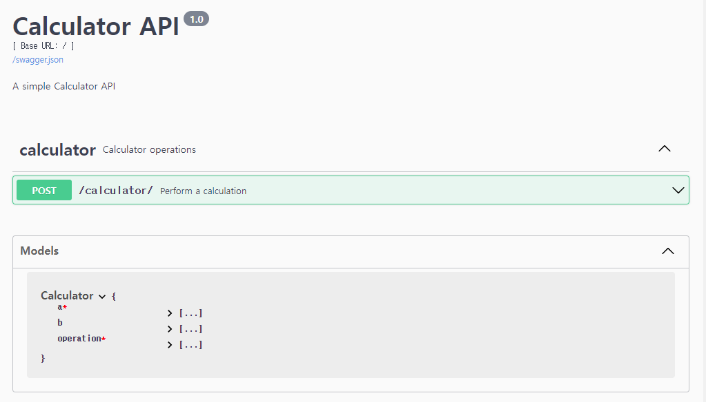
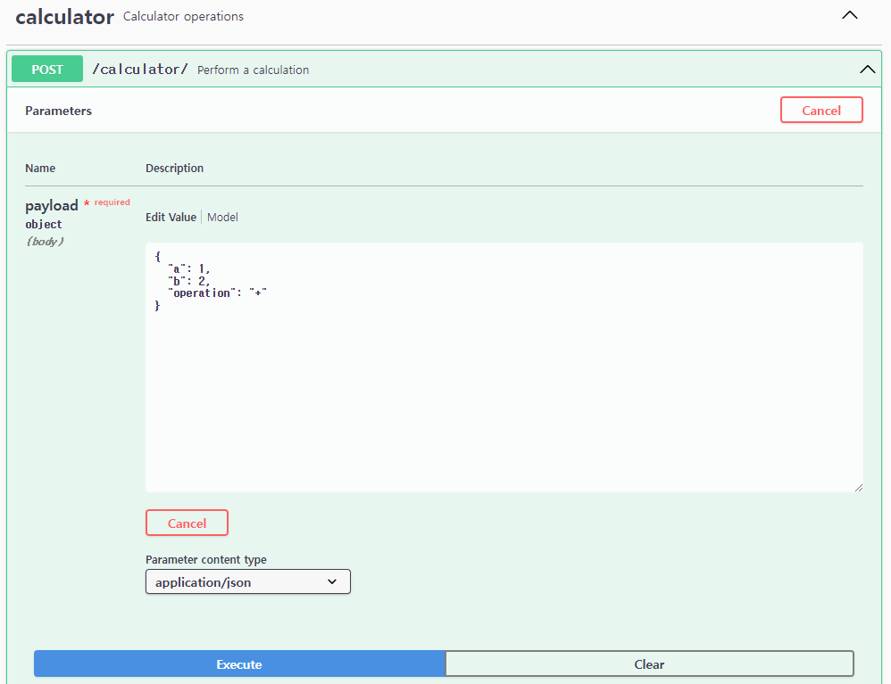
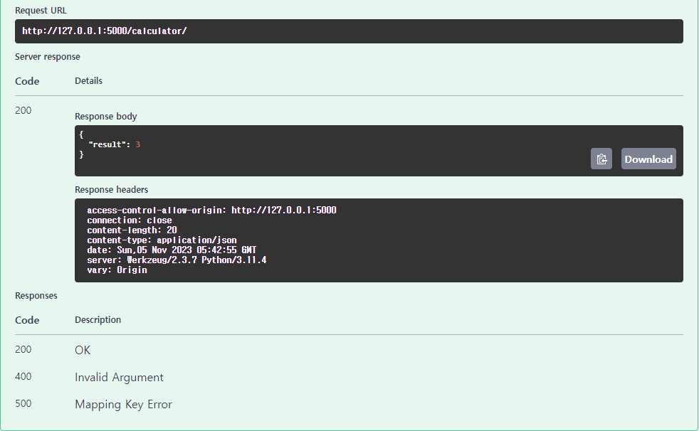
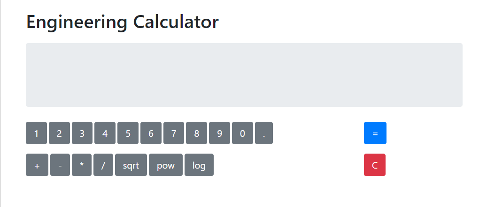

# 계산기 프로그램 만들기
## Backend 프로그램
 
```text
파이썬의 게산기 프로그램 백엔드 프로그램을 작성해 줘
```
```python
from flask import Flask, request
from flask_restx import Api, Resource, fields

app = Flask(__name__)
api = Api(app, title='Calculator API', version='1.0', description='A simple Calculator API')

ns = api.namespace('calculator', description='Calculator operations')

calculator_fields = api.model('Calculator', {
    'a': fields.Float(required=True, description='First input value'),
    'b': fields.Float(required=True, description='Second input value'),
    'operation': fields.String(required=True, description='Operation to perform', enum=['add', 'subtract', 'multiply', 'divide'])
})


def calculate(a, b, operation):
    if operation == 'add':
        return a + b
    elif operation == 'subtract':
        return a - b
    elif operation == 'multiply':
        return a * b
    elif operation == 'divide':
        if b != 0:
            return a / b
        else:
            api.abort(400, "Can't divide by 0")


@ns.route('/')
class CalculatorAPI(Resource):
    @ns.expect(calculator_fields, validate=True)
    def post(self):
        '''Perform a calculation'''
        data = request.json
        a = data['a']
        b = data['b']
        operation = data['operation']
        result = calculate(a, b, operation)
        return {'result': result}


if __name__ == '__main__':
    app.run(debug=True)
```
 
```text
위 코드를 발전 시켜 줘.  파이썬 내장 모듈인 math 를 활용하여 조금 더 많은 연산을 처리할 수 있도록 수정해 줘.
```
```python
from flask import Flask, request
from flask_restx import Api, Resource, fields
import math

app = Flask(__name__)
api = Api(app, title='Calculator API', version='1.0', description='A simple Calculator API')

ns = api.namespace('calculator', description='Calculator operations')

calculator_fields = api.model('Calculator', {
    'a': fields.Float(required=True, description='First input value'),
    'b': fields.Float(required=False, description='Second input value'),
    'operation': fields.String(required=True, description='Operation to perform', enum=['+', '-', '*', '/', 'sqrt', 'pow', 'log'])
})


def calculate(a, b, operation):
    if operation == '+':
        return a + b
    elif operation == '-':
        return a - b
    elif operation == '*':
        return a * b
    elif operation == '/':
        if b != 0:
            return a / b
        else:
            api.abort(400, "Can't divide by 0")
    elif operation == 'sqrt':
        return math.sqrt(a)
    elif operation == 'pow':
        return math.pow(a, b)
    elif operation == 'log':
        if b > 0:
            return math.log(a, b)
        else:
            api.abort(400, "b (base) must be greater than 0 for log operation")


@ns.route('/')
class CalculatorAPI(Resource):
    @ns.expect(calculator_fields, validate=True)
    @ns.doc(responses={
        200: 'OK',
        400: 'Invalid Argument',
        500: 'Mapping Key Error'
    })
    def post(self):
        '''Perform a calculation'''
        data = request.json
        a = data['a']
        b = data.get('b')  # b is not required for sqrt operation
        operation = data['operation']
        result = calculate(a, b, operation)
        return {'result': result}


if __name__ == '__main__':
    app.run(debug=True)
```
- 결과

http://127.0.0.1:5000/





---

 
```text
위 코드를 호출할 수 있는 frontend 프로그램을 작성해 줘. bootstrap 과 vue.js 를 활용 해 줘.
```

```html
<!DOCTYPE html>
<html>
<head>
    <title>Calculator</title>
    <link href="https://stackpath.bootstrapcdn.com/bootstrap/4.5.0/css/bootstrap.min.css" rel="stylesheet">
    <script src="https://cdn.jsdelivr.net/npm/vue@2.6.12"></script>
    <script src="https://cdnjs.cloudflare.com/ajax/libs/axios/0.19.2/axios.min.js"></script>
</head>
<body>
    <div id="app" class="container">
        <h1 class="mt-4 mb-4">Calculator</h1>

        <div class="form-group">
            <label for="a">First Number:</label>
            <input type="number" id="a" v-model="a" class="form-control">
        </div>

        <div class="form-group">
            <label for="b">Second Number:</label>
            <input type="number" id="b" v-model="b" class="form-control">
        </div>

        <div class="form-group">
            <label for="operation">Operation:</label>
            <select id="operation" v-model="operation" class="form-control">
                <option value="+">+</option>
                <option value="-">-</option>
                <option value="*">*</option>
                <option value="/">/</option>
                <option value="sqrt">sqrt</option>
                <option value="pow">pow</option>
                <option value="log">log</option>
            </select>
        </div>

        <button @click="calculate" class="btn btn-primary">Calculate</button>

        <h2 class="mt-4" v-if="result != null">Result: {{ result }}</h2>
    </div>

    <script>
        new Vue({
            el: '#app',
            data: {
                a: null,
                b: null,
                operation: '+',
                result: null
            },
            methods: {
                calculate: function() {
                    var vm = this;
                    axios.post('http://localhost:5000/calculator/', {
                        a: vm.a,
                        b: vm.b,
                        operation: vm.operation
                    })
                    .then(function(response) {
                        vm.result = response.data.result;
                    })
                    .catch(function(error) {
                        console.log(error);
                    });
                }
            }
        });
    </script>
</body>
</html>
```

 
```text
아래 문제를 해결 해 줘.
from origin 'null' has been blocked by CORS policy: Response to preflight request doesn't pass access control check: No 'Access-Control-Allow-Origin' header is present on
```

```python
from flask import Flask, request
from flask_restx import Api, Resource, fields
from flask_cors import CORS # 추가
import math

app = Flask(__name__)
CORS(app) # 추가
api = Api(app, title='Calculator API', version='1.0', description
```

 
```text
위 프로그램을 발전 시켜 줘. 입력되는 인자를 debug 모드에서 확인할 수 있도록 추가해 줘.
```
```python
from flask import Flask, request
from flask_restx import Api, Resource, fields
from flask_cors import CORS
import math
import logging # 로깅 모듈 추가

app = Flask(__name__)
CORS(app)
api = Api(app, title='Calculator API', version='1.0', description='A simple Calculator API')

ns = api.namespace('calculator', description='Calculator operations')

calculator_fields = api.model('Calculator', {
    'a': fields.String(required=True, description='First input value'),
    'b': fields.String(required=False, description='Second input value'),
    'operation': fields.String(required=True, description='Operation to perform', enum=['+', '-', '*', '/', 'sqrt', 'pow', 'log'])
})

# 로거 설정
logging.basicConfig(filename='calculator.log', level=logging.DEBUG)

def calculate(a, b, operation):
    a = float(a)
    b = float(b) if b else None

    if operation == '+':
        return a + b
    elif operation == '-':
        return a - b
    elif operation == '*':
        return a * b
    elif operation == '/':
        if b != 0:
            return a / b
        else:
            api.abort(400, "Can't divide by 0")
    elif operation == 'sqrt':
        return math.sqrt(a)
    elif operation == 'pow':
        return math.pow(a, b)
    elif operation == 'log':
        if b > 0:
            return math.log(a, b)
        else:
            api.abort(400, "b (base) must be greater than 0 for log operation")


@ns.route('/')
class CalculatorAPI(Resource):
    @ns.expect(calculator_fields, validate=True)
    @ns.doc(responses={
        200: 'OK',
        400: 'Invalid Argument',
        500: 'Mapping Key Error'
    })
    def post(self):
        '''Perform a calculation'''
        data = request.json
        a = data['a']
        b = data.get('b')  # b is not required for sqrt operation
        operation = data['operation']
        result = calculate(a, b, operation)
        
        # 로깅
        logging.debug(f"a: {a}, b: {b}, operation: {operation}, result: {result}")

        return {'result': result}


if __name__ == '__main__':
    app.run(debug=True)
```

 
```text
계산기 frontend 프로그램을 발전 시켜 줘. 공학용 계산기와 유사한 UI 로 변경해 줘.
```

```html
<!DOCTYPE html>
<html>
<head>
    <title>Engineering Calculator</title>
    <link href="https://stackpath.bootstrapcdn.com/bootstrap/4.5.0/css/bootstrap.min.css" rel="stylesheet">
    <script src="https://cdn.jsdelivr.net/npm/vue@2.6.12"></script>
    <script src="https://cdnjs.cloudflare.com/ajax/libs/axios/0.19.2/axios.min.js"></script>
</head>
<body>
    <div id="app" class="container mt-4">
        <h1 class="mb-4">Engineering Calculator</h1>
        <div class="jumbotron">
            <h2>{{ a }} {{ operation }} {{ b }}</h2>
            <h2 v-if="result != null">Result: {{ result }}</h2>
        </div>

        <div class="row">
            <div class="col-9">
                <button v-for="num in numbers" @click="appendNum(num)" class="btn btn-secondary btn-lg">{{ num }}</button>
            </div>
            <div class="col-3">
                <button @click="calculate" class="btn btn-primary btn-lg">=</button>
            </div>
        </div>

        <div class="row mt-3">
            <div class="col-9">
                <button v-for="op in operations" @click="setOperation(op)" class="btn btn-secondary btn-lg">{{ op }}</button>
            </div>
            <div class="col-3">
                <button @click="clear" class="btn btn-danger btn-lg">C</button>
            </div>
        </div>
    </div>

    <script>
        new Vue({
            el: '#app',
            data: {
                a: '',
                b: '',
                operation: null,
                result: null,
                numbers: ['1', '2', '3', '4', '5', '6', '7', '8', '9', '0', '.'],
                operations: ['+', '-', '*', '/', 'sqrt', 'pow', 'log']
            },
            methods: {
                appendNum: function(num) {
                    if (this.operation) {
                        this.b += num;
                    } else {
                        this.a += num;
                    }
                },
                setOperation: function(op) {
                    this.operation = op;
                },
                calculate: function() {
                    var vm = this;
                    axios.post('http://localhost:5000/calculator/', {
                        a: vm.a,
                        b: vm.b,
                        operation: vm.operation
                    })
                    .then(function(response) {
                        vm.result = response.data.result;
                    })
                    .catch(function(error) {
                        console.log(error);
                    });
                },
                clear: function() {
                    this.a = '';
                    this.b = '';
                    this.operation = null;
                    this.result = null;
                }
            }
        });
    </script>
</body>
</html>
```

 
```text
계산기 frontend 프로그램을 발전 시켜 줘. 숫자 버튼 간격을 1 씩 띄워서 표현해 줘.
```

```html
<!-- ... -->
<div class="row">
    <div class="col-9">
        <button v-for="num in numbers" @click="appendNum(num)" class="btn btn-secondary btn-lg mr-1 mb-1">{{ num }}</button>
    </div>
    <div class="col-3">
        <button @click="calculate" class="btn btn-primary btn-lg">=</button>
    </div>
</div>

<div class="row mt-3">
    <div class="col-9">
        <button v-for="op in operations" @click="setOperation(op)" class="btn btn-secondary btn-lg mr-1 mb-1">{{ op }}</button>
    </div>
    <div class="col-3">
        <button @click="clear" class="btn btn-danger btn-lg">C</button>
    </div>
</div>
<!-- ... -->
```
- 변경결과


